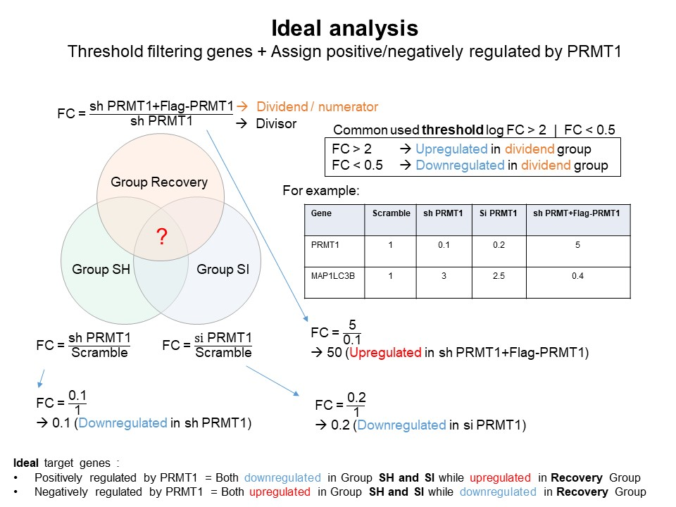
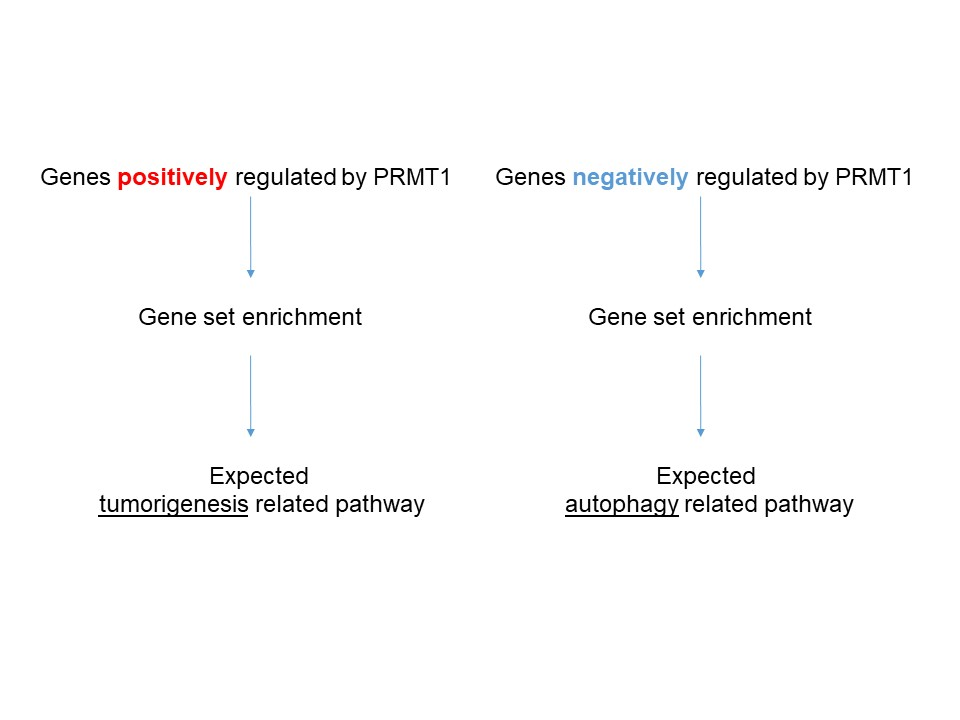

```{r setup, include=FALSE}
knitr::opts_chunk$set(echo = TRUE)
```

# Principle

 Sample types :

* Scramble
* siPRMT1
* shPRMT1
* shPRMT1 + Flag-PRMT1





# Preparation
* Install and load libraries
```{r 1, echo=TRUE, message=FALSE, warning=FALSE}
library(kableExtra)
library(tidyverse)
library(dplyr)
library(ggrepel)
library('ggvenn')
library(DT)
library(forcats)
scale_fill_aziz <- function(...){
  library(scales)
  discrete_scale("fill","aziz",manual_pal(values = c("#386cb0","#fdb462","#7fc97f","#a6cee3","#fb9a99","#984ea3","#ffff33")), ...)
  
}

scale_colour_aziz <- function(...){
  library(scales)
  discrete_scale("colour","aziz",manual_pal(values = c("#386cb0","#fdb462","#7fc97f","#ef3b2c","#662506","#a6cee3","#fb9a99","#984ea3","#ffff33")), ...)
}
theme_Publication <- function(base_size=14, base_family="helvetica") {
  library(grid)
  library(ggthemes)
  (theme_foundation(base_size=base_size, base_family=base_family)
    + theme(plot.title = element_text(face = "bold",
                                      size = rel(1.2), hjust = 0.5),
            text = element_text(),
            panel.background = element_rect(colour = NA),
            plot.background = element_rect(colour = NA),
            panel.border = element_rect(colour = NA),
            axis.title = element_text(face = "bold",size = rel(1)),
            axis.title.y = element_text(angle=90,vjust =2),
            axis.title.x = element_text(vjust = -0.2),
            axis.text = element_text(), 
            axis.line = element_line(colour="black"),
            axis.ticks = element_line(),
            panel.grid.major = element_line(colour="#f0f0f0"),
            panel.grid.minor = element_blank(),
            legend.key = element_rect(colour = NA),
            legend.position = "bottom",
            legend.direction = "horizontal",
            legend.key.size= unit(0.2, "cm"),
            legend.margin = unit(0, "cm"),
            legend.title = element_text(face="italic"),
            plot.margin=unit(c(10,5,5,5),"mm"),
            strip.background=element_rect(colour="#f0f0f0",fill="#f0f0f0"),
            strip.text = element_text(face="bold"),
            plot.subtitle = element_text(hjust = 0.5)
    ))
}

create_dt<-function(x){
  DT::datatable(x,
                extensions = 'Buttons',
                options = list(dom='Blfrtip',
                               buttons=c('copy', 'csv', 'excel','pdf', 'print'),
                               lengthMenu=list(c(10,25,50,-1),
                                               c(10,25,50,'All'))))
}
```
<br>

# Load RNAseq results

```{r 2, echo=TRUE}
fc<-read.delim("~/Repository/repository/docs/PRMT1/FC PRMT.csv") #load dataframe and name it fc
head(fc)
fc<-fc %>% 
  dplyr::select(1,2,3,5,6,7,8,9) #remove unneccessary column (shrecovery/Scramble)
head(fc)
colnames(fc)
{colnames(fc)[1]<-"Gene"
colnames(fc)[2]<-"FC.shPRMT1.per.Scramble"
colnames(fc)[3]<-"FC.siPRMT1.per.Scramble"
colnames(fc)[4]<-"FC.shPRMT1plusPRMT1.per.shPRMT1"
colnames(fc)[5]<-"Scramble"
colnames(fc)[6]<-"shPRMT1"
colnames(fc)[7]<-"siPRMT1"
colnames(fc)[8]<-"shPRMT1plusPRMT1"} #change the column name

```
<br>

# Threshold filtering (DEGs)
* Differentially expressed genes (DEGs) commonly selected after threshold filtering using both log FC value and p-value. 
* But since there is no replication in the sample, we can filter DEGs based on log FC value.

```{r 3, echo=TRUE}
fc<-fc %>% 
  mutate(grupSH=case_when(FC.shPRMT1.per.Scramble > 2 ~ 'Upregulated',
                        FC.shPRMT1.per.Scramble < 0.5 ~ 'Downregulated',
                        TRUE ~ 'Not-regulated')) %>% 
  mutate(grupSI=case_when(FC.siPRMT1.per.Scramble > 2 ~ 'Upregulated',
                          FC.siPRMT1.per.Scramble < 0.5 ~ 'Downregulated',
                          TRUE ~ 'Not-regulated')) %>% 
  mutate(grupREC=case_when(FC.shPRMT1plusPRMT1.per.shPRMT1 > 2 ~ 'Upregulated',
                           FC.shPRMT1plusPRMT1.per.shPRMT1 < 0.5 ~ 'Downregulated',
                          TRUE ~ 'Not-regulated'))

create_dt(fc)


```
## Scatter plot
```{r scatter1, echo=TRUE, message=FALSE, warning=FALSE}
# SH vs Scramble
fc %>% 
  ggplot(aes(x=Scramble,y=shPRMT1,color=grupSH))+
  geom_point(size=1.5)+
  geom_label_repel(aes(label=ifelse(Gene == 'PRMT1',as.character(Gene),'')),
                  box.padding   = .35, 
                  point.padding = 0.5,
                  max.overlaps = Inf,
                  segment.color = 'grey50',show.legend = F)+ #label PRMT1
  theme_classic()+
  scale_colour_manual(values = c('#a6cee3','gray','#fb9a99'))+
  theme_Publication()+
  theme(aspect.ratio = 1)+
  ylab("sh-PRMT1")+
  xlab("Scramble")+
  ggtitle("Group SH")

fc %>% 
  ggplot(aes(x=Scramble,y=siPRMT1,color=grupSI))+
  geom_point(size=1.5)+
  geom_label_repel(aes(label=ifelse(Gene == 'PRMT1',as.character(Gene),'')),
                  box.padding   = .35, 
                  point.padding = 0.5,
                  max.overlaps = Inf,
                  segment.color = 'grey50',show.legend = F)+ #label PRMT1
  theme_classic()+
  scale_colour_manual(values = c('#a6cee3','gray','#fb9a99'))+
  theme_Publication()+
  theme(aspect.ratio = 1)+
    ylab("si-PRMT1")+
  xlab("Scramble")+
  ggtitle("Group SI")

fc %>% 
  ggplot(aes(x=shPRMT1,y=shPRMT1plusPRMT1,color=grupREC))+
  geom_point(size=1.5)+
  geom_label_repel(aes(label=ifelse(Gene == 'PRMT1',as.character(Gene),'')),
                  box.padding   = .35, 
                  point.padding = 0.5,
                  max.overlaps = Inf,
                  segment.color = 'grey50',show.legend = F)+ #label PRMT1
  theme_classic()+
  scale_colour_manual(values = c('#a6cee3','gray','#fb9a99'))+
  theme_Publication()+
  theme(aspect.ratio = 1)+
  ylab("sh-PRMT1 + Flag-PRMT1")+
  xlab("sh-PRMT1")+
  ggtitle("Group Recovery")


```


<br>

# Assigning genes
<br>
* Make a venn diagram to see overlapping DEGs in 3 conditions.

### Venn diagram

```{r venn, echo=TRUE, message=FALSE, warning=FALSE}

# Filtered regulated genes to make venn
SH.regulated<-fc %>% 
  filter(grupSH == 'Downregulated' | grupSH == 'Upregulated')
SI.regulated<-fc %>% 
  filter(grupSI == 'Downregulated' | grupSI == 'Upregulated')
REC.regulated<-fc %>% 
  filter(grupREC == 'Downregulated' | grupREC == 'Upregulated')

D<-list('Group SH'=as.character(SH.regulated$Gene),
        'Group SI'=as.character(SI.regulated$Gene),
        'Group Recovery'=as.character(REC.regulated$Gene))

ggvenn(D,fill_color = c("#386cb0","#fdb462","gray"),fill_alpha = .3,text_size = 5,show_percentage = F)+
  ggtitle("Overlap of all genes passing the threshold (DEGs)")

```
<br>
* From venn we can see about 119 DEGs overlap, then we filter again and assign positive or negatively regulated by PRMT1
<br>
```{r over, echo=TRUE, message=FALSE, warning=FALSE}
#what are those genes?
overlap<-as.data.frame(intersect(as.character(REC.regulated$Gene),intersect(x=as.character(SH.regulated$Gene),y=as.character(SI.regulated$Gene))))
colnames(overlap)[1]<-"Gene"
overlap

#leftjoin to other parameter
overlap<-overlap %>% 
  left_join(fc) %>% 
  select(Gene,grupSH,grupSI,grupREC)

create_dt(overlap)

```

# Scenario 1 (Ideal)

## Positively regulated by PRMT1
### Make venn only positive
```{r S1pos, echo=TRUE, message=FALSE, warning=FALSE}
# We can make venn again only positive
pos.SH<-SH.regulated %>% 
  filter(grupSH=='Downregulated')
pos.SI<-SI.regulated %>% 
  filter(grupSI=='Downregulated')
pos.REC<-REC.regulated %>% 
  filter(grupREC=='Upregulated')

s1.list.pos<-list('Group SH'=as.character(pos.SH$Gene),
                   'Group SI'=as.character(pos.SI$Gene),
                   'Group Recovery'=as.character(pos.REC$Gene))

ggvenn(s1.list.pos,fill_color = c("#386cb0","#fdb462","gray"),fill_alpha = .3,text_size = 5,show_percentage = F)+
  ggtitle("Overlap DEGs",subtitle = "Positively regulated by PRMT1")
```
<br>

### Datatable overlap positive
```{r dat pos, echo=TRUE, message=FALSE, warning=FALSE}
S1.Positive.cor<-(overlap %>% filter(grupSH == 'Downregulated' & grupSI == 'Downregulated' & grupREC == 'Upregulated'))
create_dt(S1.Positive.cor)
```
<br>

### Enrichment analysis
```{r enrich1, echo=TRUE, message=FALSE, warning=FALSE}
library(enrichR)
setEnrichrSite("Enrichr") # Human genes
websiteLive <- TRUE


dbs <- c("KEGG_2021_Human","MSigDB_Hallmark_2020")
if (is.null(dbs)) websiteLive <- FALSE
if (websiteLive) {
    enriched <- enrichr(c(S1.Positive.cor$Gene), dbs)
}


kegg.pos<-as.data.frame(if (websiteLive) enriched[["KEGG_2021_Human"]])
create_dt(kegg.pos)

colnames(kegg.pos)
kegg.pos %>% 
  filter(P.value < 0.05) %>% 
  mutate(minlog=-(log10(P.value))) %>% 
  arrange(desc(minlog)) %>% 
  slice(1:20) %>% 
  mutate(name=fct_reorder(Term,minlog)) %>% 
  ggplot(aes(x=minlog,y=name,fill=minlog))+
  geom_bar(stat="identity")+
  theme_Publication()+
  scale_x_continuous(expand=expand_scale(mult = c(0,0.2)))+
  theme(axis.title.y = element_blank(),
        legend.position = 'right',
        legend.direction = 'vertical',
        panel.grid.major.x = element_blank(),
        aspect.ratio = 1.65,
        legend.key.size= unit(.5, "cm"))+
  scale_fill_viridis_c()+
  xlab(expression(- log[10]*"(P-value)"))+
  labs(fill=expression(- log[10]*"(P-value)"))+
  ggtitle("Top 20 KEGG_2021_Human",subtitle = 'Positively regulated by PRMT1')

Msig.pos<-as.data.frame(if (websiteLive) enriched[["MSigDB_Hallmark_2020"]])
create_dt(Msig.pos)

Msig.pos %>% 
  filter(P.value < 0.05) %>% 
  mutate(minlog=-(log10(P.value))) %>% 
  arrange(desc(minlog)) %>% 
  slice(1:20) %>% 
  mutate(name=fct_reorder(Term,minlog)) %>% 
  ggplot(aes(x=minlog,y=name,fill=minlog))+
  geom_bar(stat="identity")+
  theme_Publication()+
  scale_x_continuous(expand=expand_scale(mult = c(0,0.2)))+
  theme(axis.title.y = element_blank(),
        legend.position = 'right',
        legend.direction = 'vertical',
        panel.grid.major.x = element_blank(),
        aspect.ratio = 1,
        legend.key.size= unit(.5, "cm"))+
  scale_fill_viridis_c()+
  xlab(expression(- log[10]*"(P-value)"))+
  labs(fill=expression(- log[10]*"(P-value)"))+
  ggtitle("MSigDB_Hallmark_2020",subtitle = 'Positively regulated by PRMT1')


```
<br>

## Negatively regulated by PRMT1
### Make venn only negative
```{r S1neg, echo=TRUE, message=FALSE, warning=FALSE}
# We can make venn again only negative
pos.SH<-SH.regulated %>% 
  filter(grupSH=='Upregulated')
pos.SI<-SI.regulated %>% 
  filter(grupSI=='Upregulated')
pos.REC<-REC.regulated %>% 
  filter(grupREC=='Downregulated')

s1.list.neg<-list('Group SH'=as.character(pos.SH$Gene),
                   'Group SI'=as.character(pos.SI$Gene),
                   'Group Recovery'=as.character(pos.REC$Gene))

ggvenn(s1.list.neg,fill_color = c("#386cb0","#fdb462","gray"),fill_alpha = .3,text_size = 5,show_percentage = F)+
  ggtitle("Overlap DEGs",subtitle = "Negatively regulated by PRMT1")
```
<br>

### Datatable overlap negative
```{r dat neg, echo=TRUE, message=FALSE, warning=FALSE}
S1.Negative.cor<-(overlap %>% filter(grupSH == 'Upregulated' & grupSI == 'Upregulated' & grupREC == 'Downregulated'))
create_dt(S1.Negative.cor)
```
<br>

### Enrichment analysis
```{r enrich2, echo=TRUE, message=FALSE, warning=FALSE}
library(enrichR)
setEnrichrSite("Enrichr") # Human genes
websiteLive <- TRUE


dbs <- c("KEGG_2021_Human","MSigDB_Hallmark_2020")
if (is.null(dbs)) websiteLive <- FALSE
if (websiteLive) {
    enriched <- enrichr(c(S1.Negative.cor$Gene), dbs)
}


kegg.neg<-as.data.frame(if (websiteLive) enriched[["KEGG_2021_Human"]])
create_dt(kegg.neg)

kegg.neg %>% 
  filter(P.value < 0.05) %>% 
  mutate(minlog=-(log10(P.value))) %>% 
  arrange(desc(minlog)) %>% 
  slice(1:20) %>% 
  mutate(name=fct_reorder(Term,minlog)) %>% 
  ggplot(aes(x=minlog,y=name,fill=minlog))+
  geom_bar(stat="identity")+
  theme_Publication()+
  scale_x_continuous(expand=expand_scale(mult = c(0,0.2)))+
  theme(axis.title.y = element_blank(),
        legend.position = 'right',
        legend.direction = 'vertical',
        panel.grid.major.x = element_blank(),
        aspect.ratio = 1.65,
        legend.key.size= unit(.5, "cm"))+
  scale_fill_viridis_c()+
  xlab(expression(- log[10]*"(P-value)"))+
  labs(fill=expression(- log[10]*"(P-value)"))+
  ggtitle("Top 20 KEGG_2021_Human",subtitle = 'Negatively regulated by PRMT1')

Msig.neg<-as.data.frame(if (websiteLive) enriched[["MSigDB_Hallmark_2020"]])
create_dt(Msig.neg)

Msig.neg %>% 
  filter(P.value < 0.05) %>% 
  mutate(minlog=-(log10(P.value))) %>% 
  arrange(desc(minlog)) %>% 
  slice(1:20) %>% 
  mutate(name=fct_reorder(Term,minlog)) %>% 
  ggplot(aes(x=minlog,y=name,fill=minlog))+
  geom_bar(stat="identity")+
  theme_Publication()+
  scale_x_continuous(expand=expand_scale(mult = c(0,0.2)))+
  theme(axis.title.y = element_blank(),
        legend.position = 'right',
        legend.direction = 'vertical',
        panel.grid.major.x = element_blank(),
        aspect.ratio = .5,
        legend.key.size= unit(.5, "cm"))+
  scale_fill_viridis_c()+
  xlab(expression(- log[10]*"(P-value)"))+
  labs(fill=expression(- log[10]*"(P-value)"))+
  ggtitle("MSigDB_Hallmark_2020",subtitle = 'Negatively regulated by PRMT1')


```