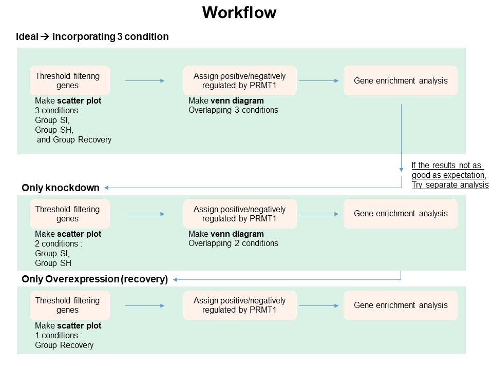

```{r setup, include=FALSE}
knitr::opts_chunk$set(echo = TRUE)
```

## Principle




## Preparation
* Install and load libraries
```{r 1, echo=TRUE, message=FALSE, warning=FALSE}
library(kableExtra)
library(tidyverse)
library(dplyr)
library(ggrepel)
library('ggvenn')
library(DT)
scale_fill_aziz <- function(...){
  library(scales)
  discrete_scale("fill","aziz",manual_pal(values = c("#386cb0","#fdb462","#7fc97f","#a6cee3","#fb9a99","#984ea3","#ffff33")), ...)
  
}

scale_colour_aziz <- function(...){
  library(scales)
  discrete_scale("colour","aziz",manual_pal(values = c("#386cb0","#fdb462","#7fc97f","#ef3b2c","#662506","#a6cee3","#fb9a99","#984ea3","#ffff33")), ...)
}
theme_Publication <- function(base_size=14, base_family="helvetica") {
  library(grid)
  library(ggthemes)
  (theme_foundation(base_size=base_size, base_family=base_family)
    + theme(plot.title = element_text(face = "bold",
                                      size = rel(1.2), hjust = 0.5),
            text = element_text(),
            panel.background = element_rect(colour = NA),
            plot.background = element_rect(colour = NA),
            panel.border = element_rect(colour = NA),
            axis.title = element_text(face = "bold",size = rel(1)),
            axis.title.y = element_text(angle=90,vjust =2),
            axis.title.x = element_text(vjust = -0.2),
            axis.text = element_text(), 
            axis.line = element_line(colour="black"),
            axis.ticks = element_line(),
            panel.grid.major = element_line(colour="#f0f0f0"),
            panel.grid.minor = element_blank(),
            legend.key = element_rect(colour = NA),
            legend.position = "bottom",
            legend.direction = "horizontal",
            legend.key.size= unit(0.2, "cm"),
            legend.margin = unit(0, "cm"),
            legend.title = element_text(face="italic"),
            plot.margin=unit(c(10,5,5,5),"mm"),
            strip.background=element_rect(colour="#f0f0f0",fill="#f0f0f0"),
            strip.text = element_text(face="bold")
    ))
}

```
<br>

## Load RNAseq results
* Note that .. indicate / from excel, so that is fold change (FC) value.
```{r 2, echo=TRUE}
fc<-read.delim("~/Repository/repository/docs/PRMT1/FC PRMT.csv") #load dataframe and name it fc
head(fc)
fc<-fc %>% 
  dplyr::select(1,2,3,5,6,7,8,9) #remove unneccessary column (shrecovery/Scramble)
head(fc)
colnames(fc)
{colnames(fc)[1]<-"Gene"
colnames(fc)[2]<-"FC.shPRMT1.per.Scramble"
colnames(fc)[3]<-"FC.siPRMT1.per.Scramble"
colnames(fc)[4]<-"FC.shPRMT1plusPRMT1.per.shPRMT1"
colnames(fc)[5]<-"Scramble"
colnames(fc)[6]<-"shPRMT1"
colnames(fc)[7]<-"siPRMT1"
colnames(fc)[8]<-"shPRMT1plusPRMT1"} #change the column name

```
<br>

## Threshold filtering (DEGs)
* Differentially expressed genes (DEGs) commonly selected after threshold filtering using both log FC value and p-value. 
* But since there is no replication in the sample, we can filter DEGs based on log FC value.

```{r 3, echo=TRUE}
fc<-fc %>% 
  mutate(grupSH=case_when(FC.shPRMT1.per.Scramble > 2 ~ 'Upregulated',
                        FC.shPRMT1.per.Scramble < 0.5 ~ 'Downregulated',
                        TRUE ~ 'Not-regulated')) %>% 
  mutate(grupSI=case_when(FC.siPRMT1.per.Scramble > 2 ~ 'Upregulated',
                          FC.siPRMT1.per.Scramble < 0.5 ~ 'Downregulated',
                          TRUE ~ 'Not-regulated')) %>% 
  mutate(grupREC=case_when(FC.shPRMT1plusPRMT1.per.shPRMT1 > 2 ~ 'Upregulated',
                           FC.shPRMT1plusPRMT1.per.shPRMT1 < 0.5 ~ 'Downregulated',
                          TRUE ~ 'Not-regulated'))

DT::datatable(fc)

#Confirm by looking at PRMT1
fc %>% 
  filter(Gene == 'PRMT1') %>% 
  select(Gene,grupSH,grupSI,grupREC)

```
### Scatter plot
```{r scatter1, echo=TRUE, message=FALSE, warning=FALSE}
# SH vs Scramble
fc %>% 
  ggplot(aes(x=Scramble,y=shPRMT1,color=grupSH))+
  geom_point(size=1.5)+
  geom_label_repel(aes(label=ifelse(Gene == 'PRMT1',as.character(Gene),'')),
                  box.padding   = .35, 
                  point.padding = 0.5,
                  max.overlaps = Inf,
                  segment.color = 'grey50',show.legend = F)+ #label PRMT1
  theme_classic()+
  scale_colour_manual(values = c('#a6cee3','gray','#fb9a99'))+
  theme_Publication()+
  theme(aspect.ratio = 1)+
  ylab("sh-PRMT1")+
  xlab("Scramble")

```
